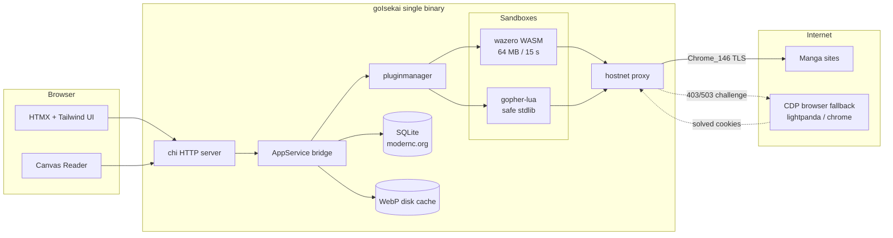
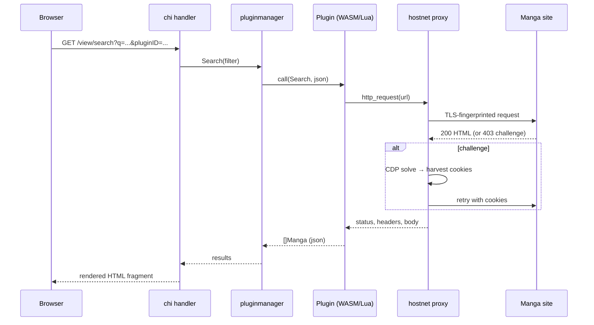

# goIsekai

A self-hosted manga reader with sandboxed plugins. Two runtimes — hardened **WASM** and zero-toolchain **Lua** — power your sources; one fast server-rendered UI reads them all.

goIsekai is a single static Go binary that serves a chi + Jet + HTMX + Tailwind web UI. Manga sources are plugins executed in isolated sandboxes, so a crashing or malicious plugin can never take down the host. All network traffic goes through a Chrome-fingerprinted TLS client, so sites behind Cloudflare just work — with an automatic browser-fallback (CDP) when a challenge appears anyway.


## Architecture



## Features

- **Dual plugin runtimes** — sandboxed **WASM** (64 MB cap, 15 s timeout, panic isolation) and **Lua** (plain text editors, no toolchain) sharing one ABI
- **Browser TLS fingerprinting** — `bogdanfinn/tls-client` with a Chrome profile + per-plugin cookie jars; built for adversarial sites
- **Automatic anti-bot fallback** — when a site returns a Cloudflare challenge, the host spawns a CDP browser (lightpanda or Chrome), solves it, harvests the cookies back into the jar, and retries the fast path — no manual paste
- **Reading experience** — HTML5 canvas reader with cursor-anchored zoom, drag pan, fit-width/fit-height/1:1 modes, RTL/LTR, keyboard nav, per-chapter read progress, Suwayomi-style read-ahead that spills into the next chapter
- **Read tracking** — per-chapter progress (`N/M` pages), strikethrough when a chapter is fully read or manually marked, reset buttons, cached-page counts
- **Disk cache in WebP** — fetched images converted to WebP (quality 85) on write; laid out per `plugin/manga/chapter`
- **Live logs** — merged app + plugin logs, filterable (`?filter=app|plugins`), selectable, copyable, clearable
- **Single static binary** — pure Go, `CGO_ENABLED=0`, cross-compiles to Linux/Windows/macOS trivially

## Request flow



## Quick start

```sh
make build          # CGO-free build -> ./goisekai
./goisekai          # serves http://localhost:8080 (add -open to launch a browser)
```

Host/port come from CLI flags or `goisekai.ini` (flags win):

```sh
./goisekai -host 127.0.0.1 -port 8080 -logLevel debug
```

## Plugins

Plugins implement a small ABI (`Init`, `SearchManga`, `GetMangaDetails`, `GetChapterList`, `GetPageList`) and call the host function `http_request` for all networking. Both runtimes are interchangeable — pick WASM for hardened plugins, Lua for quick ones.

### WASM plugins

```sh
tinygo build -o plugins/mangadex.wasm -target wasm ./plugins/mangadex/
```

Install a `.wasm` from the Plugins screen in the UI. See `examples/mangadex/` for a complete TinyGo plugin.

### Lua plugins (no toolchain needed)

One folder per site under `plugins/lua/<id>/`, with `main.lua` as the entry point; sibling modules are loadable via `require("module")` (sandboxed to the plugin folder).

```lua
local PLUGIN = {
  name = "KaliScan",
  version = "1.0.0",
  thumb_ratio = 0.71,
}

function search_manga(filter_json)
  local filter = json.decode(filter_json)
  local res = http_request({ url = "https://kaliscan.io/?s=" .. filter.query })
  -- parse res.body into a table of manga and return it
  return results
end
```

`main.lua` declares a `PLUGIN` table and four globals (`search_manga`, `get_manga_detail`, `get_chapter_list`, `get_page_list`). Each takes one JSON-string argument and returns a Lua table or JSON string. Networking goes through `http_request({url=..., method=..., headers=...})`, which rides the same TLS-fingerprinted, cookie-jarred, rate-paced session as WASM plugins. `json.encode`/`json.decode` are provided. Available stdlib: `string`, `table`, `math`, `os.time/date/clock` — no `io`, no `os.execute`. See `plugins/lua/kaliscan/` for a complete example.

```sh
make install-lua PLUGIN=kaliscan   # copies plugins/lua/kaliscan → app_data/plugins/kaliscan
```

## Anti-bot fallback (CDP)

Sites protected by Cloudflare Turnstile / DataDome can challenge the fast client. When `hostnet` detects a challenge (403/503 + marker), it falls back to a CDP-driven browser:

- `cdp_engine` — `lightpanda` (light, ~9× less memory) or `chrome` (most complete); `off` disables the fallback
- `cdp_path` — path to the browser binary

The flow: challenge detected → spawn browser → navigate & solve → harvest cookies into the plugin's jar → retry the original request. Solved cookies are scoped to the target host and return to the fast path for all subsequent requests. When the browser can't solve it, the UI shows the human-verify banner instead.

Plugins can hint `needs_js = true` in their metadata to skip the fast path and go straight to the browser.

## Development

```sh
make build      # build the server
make test       # go test ./...
make lint-web   # Biome (web sources)
make clean      # remove binary + generated assets
```

Stack: Go 1.27 · chi · CloudyKit/jet · HTMX · Tailwind (static build) · wazero · gopher-lua · tls-client · chromedp · modernc.org/sqlite (via go-jet) · gen2brain/webp.

## License

[MIT](LICENSE)
