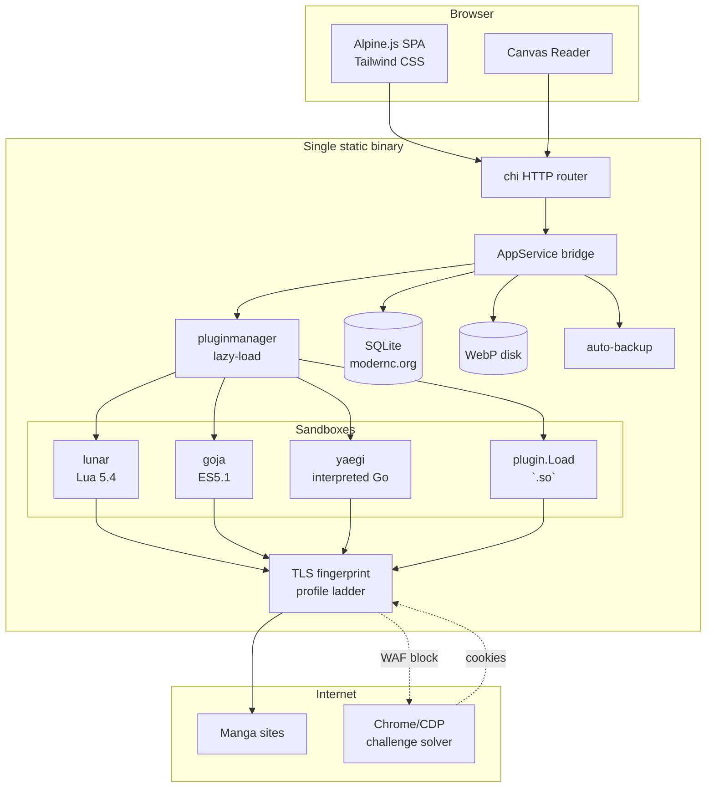
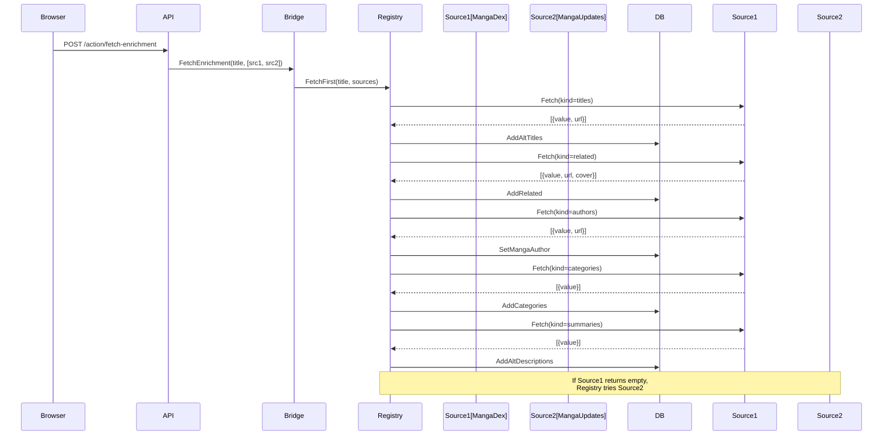
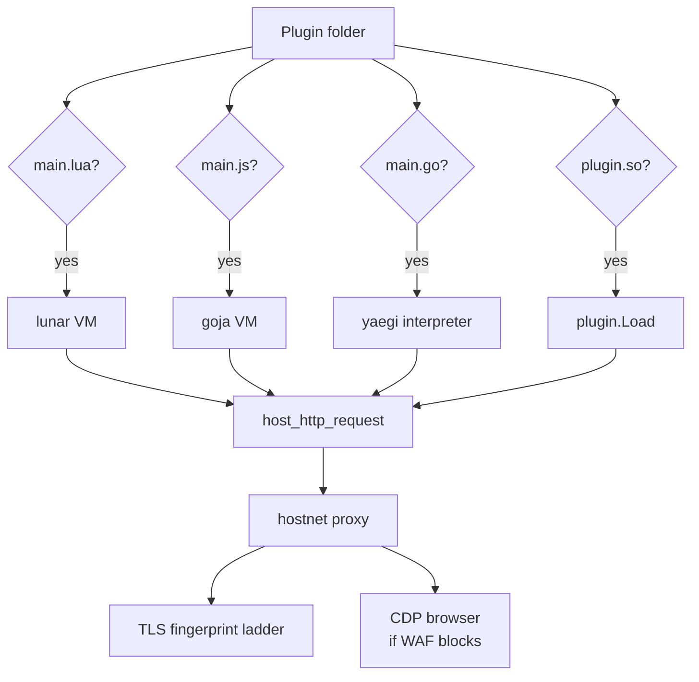

# goIsekai

A self-hosted manga reader with sandboxed plugins. Three source runtimes — zero-toolchain **Lua**, pure-Go **JS** (goja), and **Yaegi** (interpreted Go) — power your sources; one fast server-rendered UI reads them all.

goIsekai is a single static Go binary that serves a chi + Lua template engine + Alpine.js SPA with Tailwind CSS. Manga sources are plugins executed in isolated sandboxes, so a crashing or malicious plugin can never take down the host. All network traffic goes through a Chrome-fingerprinted TLS client with an automatic profile-ladder that rotates fingerprints on WAF blocks — with an automatic browser fallback (CDP) when a challenge appears anyway.


## Architecture

### Layer diagram



### Enrichment precedence



### Plugin runtime selection



### HTTP route groups

```mermaid
graph TD
    A[/] --> B[Static assets]
    A --> C[HTML views]
    A --> D[/api JSON endpoints]
    A --> E[/action HTMX]
    A --> F[/image proxy]
    A --> G[/plugin-static]

    B --> B1["/static/*"]
    C --> C1["/view/library"]
    C --> C2["/view/manga/{id}"]
    C --> C3["/view/plugins"]
    C --> C4["/view/settings"]
    C --> C5["/view/logs"]
    C --> C6["/view/history"]
    C --> C7["/view/search"]
    C --> C8["/view/updates"]
    C --> C9["/view/read/{id}"]

    D --> D1["GET /health"]
    D --> D2["GET /library"]
    D --> D3["GET /search"]
    D --> D4["GET /manga/{id}"]
    D --> D5["GET /manga/{id}/enrichment"]
    D --> D6["GET /manga/{id}/categories"]
    D --> D7["GET /manga/{id}/related"]
    D --> D8["DELETE /manga/{id}/alt-titles"]
    D --> D9["PUT /manga/{id}/title"]
    D --> D10["GET /logs"]
    D --> D11["GET /history"]
    D --> D12["GET /plugins"]
    D --> D13["GET /stats"]
    D --> D14["POST /library/toggle/{id}"]
    D --> D15["POST /chapters/read/{id}"]
    D --> D16["POST /progress/{id}"]
    D --> D17["GET /image/{id}"]
    D --> D18["GET /image/{plugin}/{manga}/{chapter}"]

    E --> E1["POST /action/install-plugin"]
    E --> E2["POST /action/toggle-plugin/{id}"]
    E --> E3["POST /action/toggle-library/{id}"]
    E --> E4["POST /action/sync"]
    E --> E5["POST /action/set-title/{id}"]
    E --> E6["POST /action/remove-alt-title/{id}"]
    E --> E7["POST /action/set-summary/{id}"]
    E --> E8["POST /action/remove-alt-summary/{id}"]
    E --> E9["POST /action/fetch-enrichment/{id}"]
    E --> E10["POST /action/remove-genre/{id}"]
    E --> E11["POST /action/remove-related/{id}"]
    E --> E12["POST /action/remove-category/{id}"]
    E --> E13["POST /action/add-category/{id}"]
    E --> E14["POST /action/add-genre/{id}"]
    E --> E15["POST /action/reset-enrichment/{id}"]
    E --> E16["POST /action/set-chapter-progress"]
    E --> E17["POST /action/mark-read/{id}"]

    G --> G1["/plugin-static/{id}/{file}"]
    F --> F1["/image?pluginID=&url=&mangaID=&chapterID="]
```

## Features

- **Three source runtimes** — **Lua** (lunar, plain text, no toolchain), **JS** (goja, ES5.1, JSON native), and **Yaegi** (interpreted Go, stdlib + `hostnet` sandbox). Native **Go** (.so) plugins remain supported. All share one ABI; plugins are lazy-loaded on first use
- **API-first** — every feature has a JSON endpoint under `/api` with constant-time API-key auth; the HTML UI and any future client consume the same bridge
- **TLS profile ladder** — `bogdanfinn/tls-client` with a rotation ladder of 7+ browser profiles (Chrome, Firefox, Safari, Edge, Brave); WAF block on one profile triggers escalation to the next, first success is pinned per plugin and persisted to DB
- **Automatic anti-bot fallback** — when a site returns a Cloudflare challenge, the host spawns a CDP browser (lightpanda or Chrome), solves it, harvests the cookies back into the jar, and retries the fast path — no manual paste
- **SPA reader** — canvas reader with fetch-swap chapter navigation (no page reload), cursor-anchored zoom, drag pan, fit-width/fit-height/1:1 modes, RTL/LTR, keyboard nav (arrows/space/Esc/Home/End/r/PageUp/Down), per-chapter read progress, read-ahead prefetch into the next chapter
- **Read tracking** — per-chapter progress (`N/M` pages), strikethrough when a chapter is fully read or manually marked, reset buttons, cached-page counts, continue-from-history
- **Alt-title & alt-summary enrichment** — info scripts under `info/<id>/` fetch titles, synopsis, genres, author, and related manga from a metadata site; the host stores each in the detail page's alt sections so you pick what to promote to main
- **Library stats** — sidebar with title counts by status (done/ongoing/unknown), read progress, estimated time spent, most/fewest chapters, per-plugin title counts, duplicate detection
- **FTS5 library search** — full-text search across titles and alt-titles with Go-side fuzzy ranking (exact > prefix > substring > subsequence)
- **CBZ export** — per-manga or per-chapter export from the disk cache as an ordered ZIP (1.webp, 2.webp, …); works offline for fully-read chapters
- **Custom confirm & toast** — in-page confirm modal and stacked toast notifications (success/error/info), replacing browser-native dialogs
- **Live logs** — merged app + plugin logs over WebSocket, filterable, selectable, copyable, clearable
- **Auto-backup & orphan prune** — scheduled SQLite backups with configurable retention, plus automatic cleanup of orphaned chapters, history, and alt-titles at startup
- **Restart API** — `POST /api/restart` re-execs the binary in-place for zero-downtime reloads
- **Brotli precompression** — static JS/CSS served as `.br` when the client accepts it
- **Single static binary** — pure Go, `CGO_ENABLED=0`, cross-compiles to Linux/Windows/macOS trivially

## Quick start

```sh
just build          # CGO-free build -> ./goisekai
./goisekai          # serves http://localhost:8080 (add -open to launch a browser)
```

Host/port come from CLI flags or `goisekai.ini` (flags win):

```sh
./goisekai -host 127.0.0.1 -port 8080 -logLevel debug -apiKey your-secret
```

## Plugins

Plugins implement a small ABI (`Init`, `SearchManga`, `GetMangaDetails`, `GetChapterList`, `GetPageList`) and call the host function `http_request` for all networking. All runtimes are interchangeable — pick Lua for quick ones, JS for JSON-heavy ones, Yaegi when Go stdlib matters.

### Lua plugins (no toolchain needed)

One folder per site under `plugins/lua/<id>/`, with `main.lua` as the entry point; sibling modules are pre-loaded and loadable via `require("module")` (sandboxed to the plugin folder).

```lua
local PLUGIN = {
  name = "KaliScan",
  version = "1.0.0",
  thumb_ratio = 0.71,
}

function search_manga(filter_json)
  local filter = json.decode(filter_json)
  local res = http_request({ url = "https://kaliscan.io/?s=" .. filter.query })
  return results
end
```

`main.lua` declares a `PLUGIN` table and ABI globals (`search_manga`, `get_manga_detail`, `get_chapter_list`, `get_page_list`). Each takes one JSON-string argument and returns a Lua table. Networking goes through `http_request({url=..., method=..., headers=...})`, which rides the same TLS-fingerprinted, cookie-jarred, rate-paced session as all other runtimes. `json.encode`/`json.decode` are provided. Available stdlib: `string`, `table`, `math`, `os.time/date/clock` — no `io`, no `os.execute`.

Reusable modules (`helpers.lua`) can be copied across plugins for shared utilities. See `examples/plugins/lua/mangabuddy/` for a complete example.

### Info scripts (metadata enrichment)

One folder per metadata source under `info/<id>/`, with `main.lua` as the entry point. Info scripts serve metadata, not chapters: they are never offered as a manga source and never read a page. Dropping a new folder is all it takes to add a provider.

```lua
PLUGIN = {
  contract_version = 1,
  name = "MangaDex Info",
  enrichment_providers = {
    { id = "mangadex", name = "MangaDex",
      kinds = { "titles", "summaries", "categories", "authors", "related" } },
  },
}

function getEnrichment(arg)   -- {"title":..., "kind":..., "source":...}
  return host.json.encode({ { value = "Berserk Gaiden", url = "https://mangadex.org/title/..." } })
end
```

**Enrichment precedence.** When "Fetch Details" is triggered, the host iterates sources in discovery order and assigns each enrichment kind to the first provider that returns non-empty results. For example, if `mangadex` is registered first and returns titles/summaries/categories/authors/related, only `mangadex` data is stored for those kinds. `mangaupdates` (registered second) only fills kinds that `mangadex` returns empty — it acts as a fallback. This ensures predictable, deterministic enrichment without duplicates.

See `examples/info/mangadex/main.lua` and `examples/info/mangaupdates/main.lua`.

### JS plugins (no toolchain needed)

One folder per site under `plugins/js/<id>/`, with `main.js` as the entry point.

```js
var PLUGIN = {
  name: "MangaDex",
  version: "1.0.0",
  thumb_ratio: 0.71,
};

function search_manga(filterJson) {
  var filter = JSON.parse(filterJson);
  var res = JSON.parse(http_request(JSON.stringify({
    url: "https://api.mangadex.org/manga?title=" + encodeURIComponent(filter.query)
  })));
  return res.data;
}
```

Same ABI as Lua — `PLUGIN` metadata + PascalCase globals. `http_request` takes a JSON string, returns a JSON string. `json` is native JS. See `examples/plugins/js/mangadex/` for a complete example.

### Yaegi plugins (interpreted Go)

One folder per site under `plugins/yaegi/<id>/`, with `main.go` as the entry point. The host interprets the source with Yaegi — no toolchain required.

```go
func Init() string {
	return `{"name":"Demo","thumb_ratio":0.7}`
}

func Search(arg string) (string, error) {
	body, err := hostnet.Get("https://example.com/search?q=" + arg)
	return body, err
}
```

ABI functions take one string arg and return `(string, error)`; `Init` takes no arg. Networking goes through the synthetic `hostnet` package (`hostnet.Get`/`hostnet.Post`), which routes through the same TLS-fingerprinted per-plugin proxy. Sandbox: the Go stdlib is available, but any third-party (`github.com/...`) or `goisekai/...` import is rejected at load time. See `examples/plugins/yaegi/yaegidemo/` for a complete example.

```sh
just install-lua kaliscan   # copies a Lua plugin → app_data/plugins/
```

## TLS profile ladder

The host maintains a rotation ladder of diverse TLS browser profiles (Chrome, Firefox, Safari, Edge, Brave, iOS, plus a stdlib fallback). When a WAF blocks a request (403 with captcha/challenge markers), the host escalates to the next profile in the ladder. The first successful profile is pinned in-memory and persisted to the DB for that plugin, so subsequent requests skip the ladder entirely.

Plugins can declare `http_profiles` in their metadata to customize the trial order; undeclared plugins use the default ladder. The Plugins page shows each plugin's pinned profile with Test and Reset controls.

## Anti-bot fallback (CDP)

Sites protected by Cloudflare Turnstile / DataDome can challenge the fast client. When `hostnet` detects a challenge (403/503 + marker), it falls back to a CDP-driven browser:

- `cdp_engine` — `lightpanda` (light, ~9× less memory) or `chrome` (most complete); `off` disables the fallback
- `cdp_path` — path to the browser binary

The flow: challenge detected → spawn browser → navigate & solve → harvest cookies into the plugin's jar → retry the original request. Solved cookies are scoped to the target host and return to the fast path for all subsequent requests. When the browser can't solve it, the UI shows the human-verify banner instead.

Plugins can hint `needs_js = true` in their metadata to skip the fast path and go straight to the browser.

## API

All features are available as JSON endpoints under `/api`. Pass `-apiKey` to require an API key (constant-time comparison, 401 for all probes).

```sh
curl -H "X-API-Key: your-secret" http://localhost:8080/api/search?pluginID=mangadex&q=isekai
```

See `docs/API.md` for the full endpoint reference.

## Development

```sh
just                 # build the server (the default recipe)
just test            # go test ./internal/... ./pkg/... ./cmd/...
just race            # the same, under the race detector
just lint            # golangci-lint
just lint-web        # Biome (web sources)
just check           # fmt + modernize + lint, production Go only
just install-lua kaliscan   # install a Lua plugin into app_data/plugins/
just br              # brotli-compress static assets
just clean           # remove the binary
just --list          # everything else
```

Stack: Go 1.27 · chi · Lua templates (lunar) · Alpine.js · Tailwind CSS (static build) · Extism · goja · tls-client · chromedp · modernc.org/sqlite (via go-jet) · gen2brain/webp.

## License

[MIT](LICENSE)
