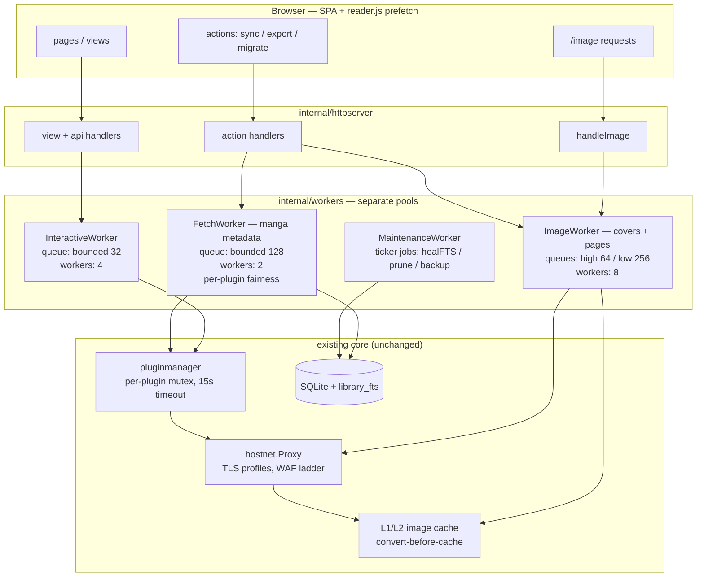
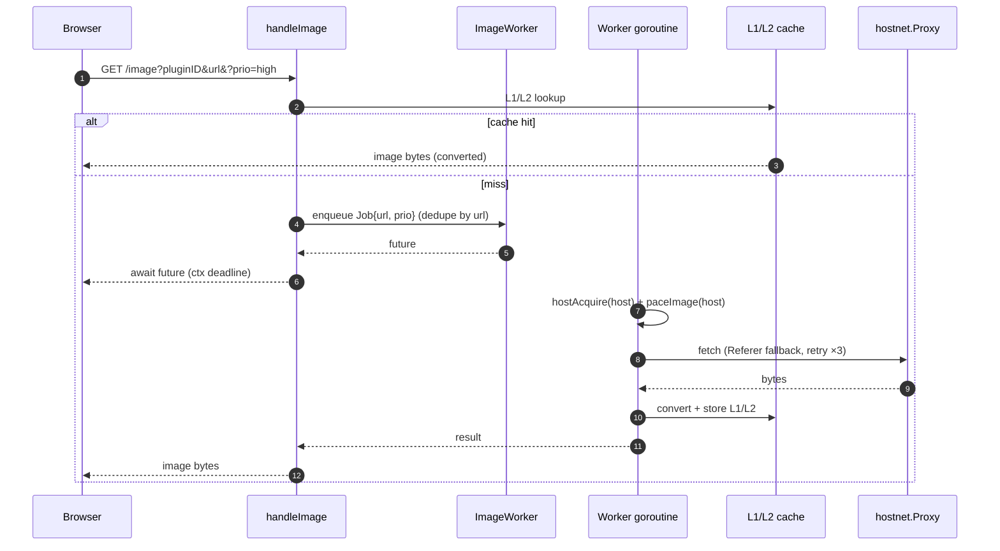
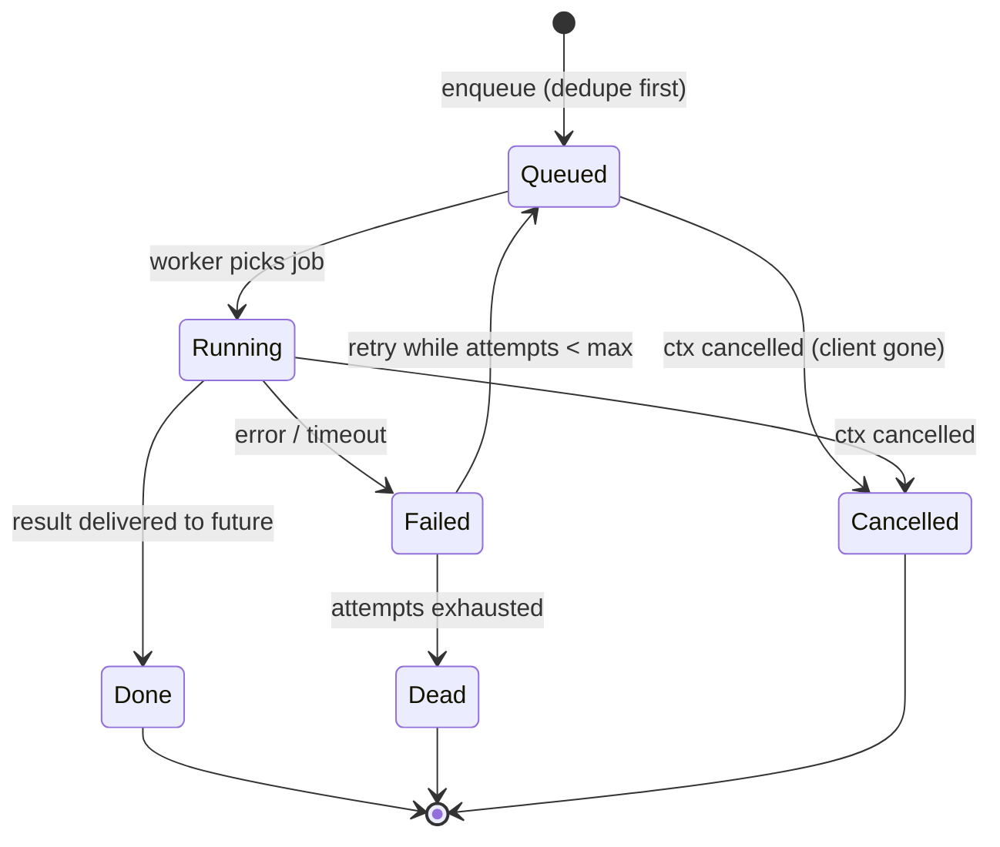

# Multi-Worker Architecture — `feat_multiworker`

Status: **proposal / analysis only** (no code landed).
Scope: separate worker lanes for **UI/interactive** handling and **manga/cover fetching**, modelled on Suwayomi-Server's worker split (researched via DeepWiki) and grounded in goIsekai's current concurrency code.

---

## 1. Goals

1. Keep the **UI interactive** at all times: user-facing requests (search, detail, chapter list, reader-data, actions) must never wait behind bulk background fetches.
2. Move **manga metadata fetching** and **cover/page image fetching** onto dedicated workers, each with its own queue and concurrency limit — **separate pools, not one shared pool**.
3. Replace goroutine-per-request blocking (export, sync, image pacing sleeps) with bounded queues + observable job state.

Non-goals (YAGNI): distributed queues, persistent job stores, a generic task framework, plugin-runtime changes. Three typed pools with typed jobs is the ceiling.

---

## 2. Current State (as-is)

Everything runs either on the HTTP request goroutine or in one maintenance ticker goroutine. Evidence:

| Mechanism | Where | Behaviour today |
| --- | --- | --- |
| Request handlers | `internal/httpserver/actions_cache.go:17` (`handleExportCBZ`), `actions_library.go:34` (`handleSync`) | Run **synchronously on the request goroutine**. A cold-chapter CBZ export blocks an HTTP request for the full `GetPageList` + N×`GetImage` loop. |
| Plugin invoke | `internal/pluginmanager` (per-plugin `sync.Mutex`, 15 s `invokeTimeout`) | Serialized per plugin; a slow plugin blocks its caller for up to 15 s. |
| Image fetch | `internal/bridge/image.go:49` `GetImage` | L1/L2 cache → shared fetch (singleflight-style) → retry ×3 → convert-before-cache. |
| Per-host lanes | `internal/bridge/image_pace.go:38` `hostAcquire` | Per-host semaphore: **2 × PrioHigh + 1 × PrioLow** concurrent, FIFO waiter channels. Waiting happens on the **caller's goroutine**. |
| Per-host pacing | `internal/bridge/image_pace.go:115` `paceImage` | 1100 ms minimum gap per host, `time.Sleep` on the **caller's goroutine**. |
| Priority | `Prio` in `image_pace.go:15`; call sites: `handleImage` (query `?prio=high`), `progress.go:145` (cover download = High), `export.go:58` (export page fetch = Low) | Two lanes only; no queue visibility. |
| UI prefetch | `cmd/goisekai/frontend/lib/reader.js` (`prefetch`, `prefetchNext`, `warmNeighbor`) | Client-side only; each prefetch still lands on a request goroutine + image lanes. |
| Maintenance | `cmd/goisekai/maintenance.go:97` `startMaintenance` | One ticker goroutine: `PruneOrphans` → `healFTS` → DB backup → `pruneImageCache`. Already a separate lane (good). |
| Covers on library add | `internal/bridge/progress.go:145` | Inline on the request path with `PrioHigh`. |

**Pain points**

1. Export/sync block a request for tens of seconds; the browser spinner is the only progress signal.
2. `paceImage`'s 1100 ms sleeps and `hostAcquire` waits are paid by request goroutines — a burst of covers ties up HTTP handlers.
3. No backpressure policy: everything is "spawn a goroutine per request, hope the per-host gate holds".
4. Interactive work and bulk work share the same request pool (Go's HTTP server goroutines), so bulk work competes with UI work for the same plugin mutexes and host lanes.

---

## 3. Reference: Suwayomi-Server workers (DeepWiki research)

| Suwayomi component | Purpose | Parallelism | Queue |
| --- | --- | --- | --- |
| `DownloadManager` + `Downloader` | Chapter download jobs, one `Downloader` per source | `serverConfig.maxSourcesInParallel` | Global `CopyOnWriteArrayList<DownloadQueueItem>` |
| `Updater` | Library updates (new chapters + metadata) | `Semaphore(maxSourcesInParallel)` on `Dispatchers.Default` | `Channel<UpdateJob>` per source; `HAScheduler` for timed updates |
| GraphQL/Javalin layer | Request handling | `CoroutineScope(Dispatchers.IO)` | Handlers hand off with `ctx.future` (async, non-blocking) |
| Covers / page images | **No dedicated pool** — inline on request threads | Suspend functions (`getImageResponse`: cache-then-fetch), `ThumbnailDownloadHelper` / `ThumbnailFileProvider`, `ChapterDownloadHelper` | — |

Takeaways worth stealing:

1. **Separate managers per workload class** (downloads vs library updates), each with its own parallelism cap keyed to `maxSourcesInParallel`.
2. **Per-source fairness**: one downloader/channel per source so a slow source cannot monopolise the pool.
3. **Async request layer**: handlers never do the work themselves; they enqueue and await a future.
4. Suwayomi does *not* pool image fetches — goIsekai already has a stronger image gate (`hostAcquire` + `paceImage`); we should promote it into a worker instead of copying Suwayomi here.

---

## 4. Proposed Design (to-be)

### 4.1 Worker topology

Four lanes. The first three are new; the fourth formalises what exists.



### 4.2 Lane contracts

| Lane | Jobs | Concurrency | Priority | Who enqueues |
| --- | --- | --- | --- | --- |
| **InteractiveWorker** | `Search`, `GetMangaDetail`, `GetChapterList`, `GetPageList`, `reader-data`, UI-triggered enrichment | 4 workers, bounded queue 32 | Highest — its own pool, so background work can never starve it | view/api handlers (`viewSearch`, `apiSearch`, reader-data) |
| **FetchWorker** | `SyncLibrary`, `SyncManga`, migration candidate search, chapter refresh, `FetchEnrichment`, cover download on library-add | 2 workers (≈ Suwayomi `maxSourcesInParallel`), bounded queue 128, **one in-flight job per plugin** | Normal | action handlers, maintenance, migrate flow |
| **ImageWorker** | cover fetches, reader page images, export page fetches, thumbnail warm | 8 workers; keep `hostAcquire` (2 High + 1 Low per host) + `paceImage` as the **transport gate**, now applied on pool workers instead of request goroutines | Two sub-queues: **High** (UI-visible covers, reader pages) → **Low** (export, prefetch, warm) | `handleImage`, `GetImage` callers, export |
| **MaintenanceWorker** | `PruneOrphans`, `healFTS`, DB backup, `pruneImageCache` | 1 worker (serial), ticker-triggered | Lowest | existing `startMaintenance` ticker |

Rules:

1. **Pools are independent** — a full FetchWorker or ImageWorker queue never blocks InteractiveWorker. The only shared chokepoints left are the per-plugin mutex (unavoidable, VM constraint) and SQLite writes (WAL already, keep transactions short).
2. **Request handlers enqueue and await** a `context.Context`-aware future (mirrors Suwayomi's `ctx.future`); the handler goroutine waits on the future, not on pacing sleeps.
3. **Backpressure**: interactive queue full → block with request deadline, then 503. Background queues full → block enqueue with timeout, surface "busy" in the action response (no silent goroutine growth).
4. **Dedupe stays**: singleflight for identical image URLs is applied at enqueue time so N UI requests share one queued job.

### 4.3 Cover-fetch sequence (to-be)



### 4.4 Job lifecycle (all lanes)



### 4.5 Suwayomi ↔ goIsekai mapping

| Suwayomi | goIsekai equivalent | Notes |
| --- | --- | --- |
| `DownloadManager` / `Downloader` | **ImageWorker** (pages, covers) + **FetchWorker** (chapter list) | We split "download" by data kind: metadata vs images. |
| `Updater` (Semaphore + per-source `Channel`) | **FetchWorker** with per-plugin fairness | Library sync = our "library update". |
| `maxSourcesInParallel` | `[workers] fetch = 2` (INI knob) | Same semantics: cap concurrent source calls. |
| GraphQL `ctx.future` | handler awaits `workers.Future` | Same async request pattern. |
| `ThumbnailDownloadHelper` (inline) | **FetchWorker** job `CoverDownload` | We make it a worker because our covers sit behind gated CDNs and pacing. |
| `HAScheduler` timed updates | existing `startMaintenance` ticker | Already exists as MaintenanceWorker. |

---

## 5. Config (proposed INI)

```ini
[workers]
interactive = 4      ; UI/interactive job workers
fetch = 2            ; manga metadata jobs (per-plugin fairness)
image = 8            ; cover/page image workers (host lanes still apply)
queue_interactive = 32
queue_fetch = 128
queue_image = 256
```

Defaults are code constants; the INI block only exists so a deployment can tune without rebuild (matching the project's hot-reload-friendly config style). Nothing else — no per-plugin knobs.

---

## 6. Migration Plan

| Phase | Work | Risk | Verifiable by |
| --- | --- | --- | --- |
| **P1 — ImageWorker** | Move `GetImage` pacing/waiting off request goroutines onto 8 workers with High/Low sub-queues; `handleImage` awaits a future | Medium (reader is hot path) | Reader feels unchanged; export of a cold chapter no longer blocks its request; concurrent cover burst keeps host lanes (2+1) |
| **P2 — FetchWorker** | Sync, migration search, enrichment, library-add cover download become queued jobs with job status on the WS | Medium | `POST /action/sync` returns immediately with job id; UI shows progress |
| **P3 — InteractiveWorker** | Route plugin invokes for UI requests through the interactive pool | Low-medium (plugin mutex still serializes) | 15 s plugin stall no longer affects other plugins' UI requests beyond the mutex |
| **P4 — formalize MaintenanceWorker** | Rename/extract `startMaintenance` into the workers package with the same ticker jobs | Low | Behaviour identical, one package owns all lanes |

Each phase is independently shippable and revertible. No phase requires the later ones.

---

## 7. Risks & Open Questions

1. **Per-plugin mutex remains the shared chokepoint.** Interactive and Fetch lanes both invoke plugins; a 15 s plugin call still blocks the other lane's jobs for that plugin. Acceptable for now (VM constraint) — revisit only if observed in practice.
2. **SQLite write contention** grows with FetchWorker parallelism (2). Keep sync/enrichment writes in short transactions; WAL + busy_timeout 5000 ms already in place.
3. **Export job UX**: P2 turns export into a background job — the UI needs a job status surface (reuse the logs page / WS). Decision needed before P2: job list page vs toast only.
4. **Future typing**: one generic `Job` interface vs per-lane typed jobs — proposal is per-lane typed jobs (compile-time safety, no reflection).
5. **Graceful shutdown**: pools must drain or cancel on shutdown (ctx from `main`), including in-flight image writes to L1/L2.

---

## 8. Evidence Trail

- goIsekai: `internal/bridge/image.go`, `internal/bridge/image_pace.go`, `internal/bridge/export.go`, `internal/httpserver/actions_cache.go`, `internal/httpserver/actions_library.go`, `internal/httpserver/image.go`, `cmd/goisekai/maintenance.go`, `cmd/goisekai/frontend/lib/reader.js`
- Suwayomi-Server (DeepWiki): `DownloadManager`/`Downloader`, `Updater`, `JavalinSetup`, `Manga.getMangaThumbnail`, `Page.getPageImageServe`, `ThumbnailFileProvider`
